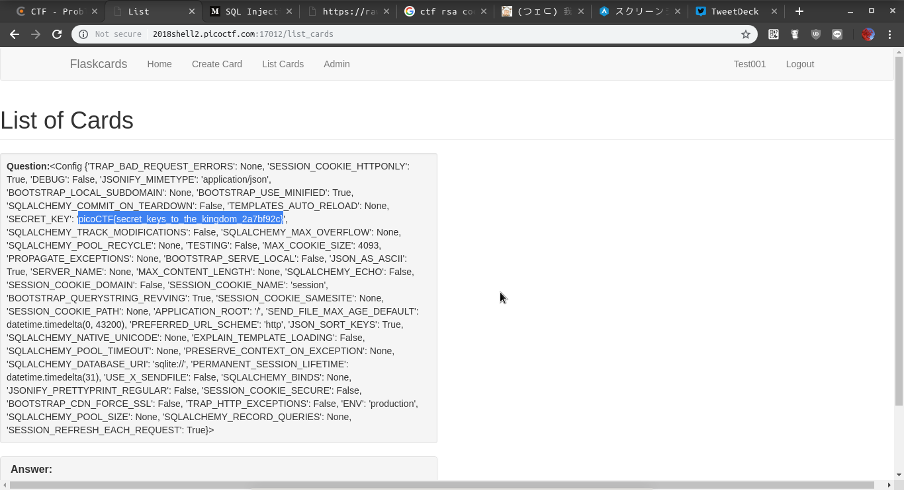

<!-- This markdown file is writeup template. -->

# PicoCTF_2018:  Flaskcards

**Category:** Web Exploitation  
**Points:** 350pt  
**Description:**

> We found this fishy [website](http://2018shell2.picoctf.com:17012) forflashcards that we think may be sending secrets. Could you take a look?

**Hint:**

> ['Are there any common vulnerabilities with the backend of the website?', "Is there anywhere that filtering doesn't get applied?", 'The database gets reverted every 2 hours so your session might end unexpectedly. Just make another user']

## Write-up
`Server-Side Template Injection:SSTI`っぽい問題だった．
flaskの脆弱性っぽい情報が掲示板に出回っていたので`Create Card`で`{{config}}`と入力したカードを作成し，リストを確認するとテンプレート処理の結果が表示されていた．

`SECRET_KEY`にフラグ情報が記載されている．PayPalやUberなどでも検出されている事例があるらしい．

## Flag

`picoCTF{secret_keys_to_the_kingdom_2a7bf92c}`