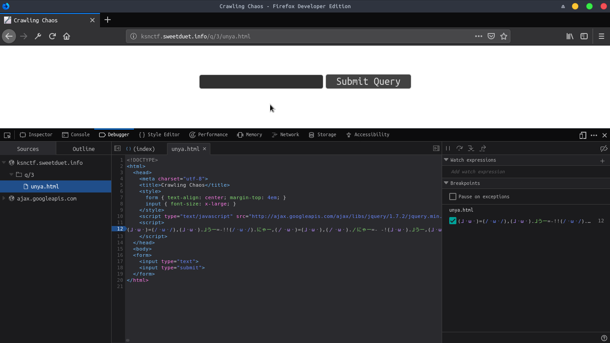
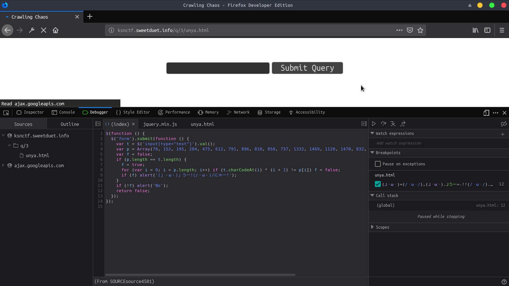

# ksnctf: Crawling Chaos

**Category:** Web  
**Points:** 100pt   
**Description:**  

> [http://ksnctf.sweetduet.info/q/3/unya.html](http://ksnctf.sweetduet.info/q/3/unya.html)

**Hint:**

>

## 解き方
適当な値を入れてsubmitするも存在を否定されてしまう．とりあえずfirefoxの開発者ツールでソースを眺めると明らかに怪しいスクリプトが埋め込まれている．タイトル名からしてニャル子さんである．



うーにゃーで難読化したJSっぽいがデコードはつらいので，breakpointを設定して再読込でデバッガーを起動してみる．`step in`や`step over`で進めていくと解読したJavaScriptが出てきた．



どうやらflagっぽい出力を得られそうなので，該当部をpythonで実装してみる．

```python
#!/usr/bin/env python

p = [70,152,195,284,475,612,791,896,810,850,737,1332,1469,1120,1470,832,1785,2196,1520,1480,1449]
flag = ''

for i, val in enumerate(p):
    flag += chr(int(val/(i+1)))

print(flag)
print("(」・ω・)」うー!(/・ω・)/にゃー!")
```

flagを取得できた．ニャル子さん懐かしい．