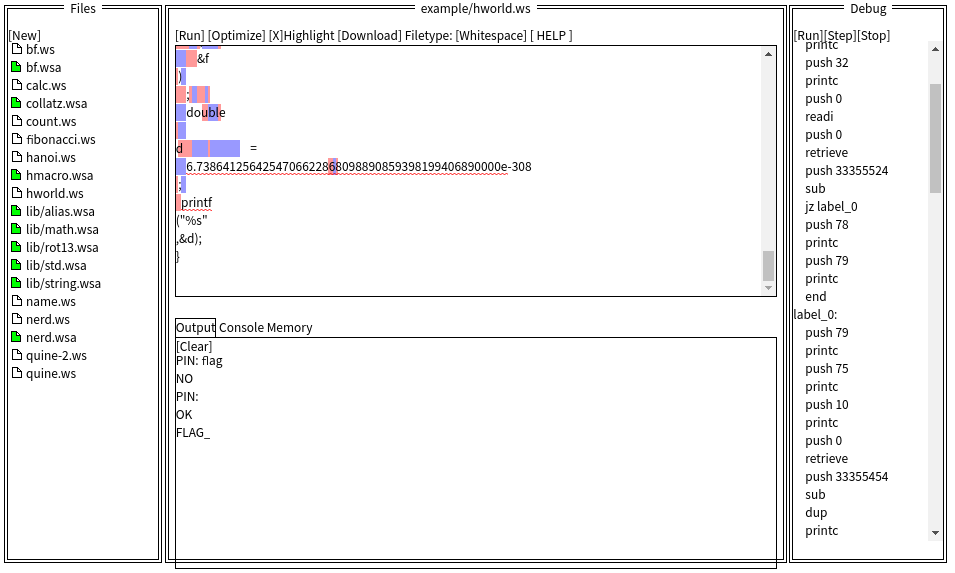

# ksnctf: Programming

**Category:** Misc  
**Points:** 110pt  
**Description:**  

> http://ksnctf.sweetduet.info/q/7/program.cpp

**Hint:**

>

## 解き方
取得したソースコードが`c/c++`っぽいのでコンパイルしてみるが，どうも違うらしい．
ソースコードを見ると不自然な空白だらけであった．難読化が目的と思われる．

```
$ g++ program.cpp 
$ ./a.out 
FROG_This_is_wrong_:(
$ bat program.cpp 
───────┬───────────────────────────────────────────────────────────────────────────────────────────────────────────────────────────────────────────────
       │ File: program.cpp
───────┼───────────────────────────────────────────────────────────────────────────────────────────────────────────────────────────────────────────────
   1   │ #include                <stdio.h>    
   2   │         
   3   │         #include          <string.h>    
   4   │         
   5   │   int                   main             
   6   │         ()
   7   │    {    const           char    * 
   8   │ s       =
   9   │  "          " 
  10   │ "0123456789"    
  11   │ "     "
  12   │         
  13   │ "                  "
  14   │ "                                                                                                                                             
       │    "        
  15   │          "ABCDEFGHIJ"   ;
- 省略 -
```

そういえば，はせがわさんの[ブラウザハック](http://amzn.asia/d/ey314PM)に[空白による難読化](https://www.defcon.org/images/defcon-16/dc16-presentations/defcon-16-kolisar.pdf)の紹介があったなと思い出し調べてみると，奇妙なIDEを発見した．

- [Whitelips the Whitespace IDE](http://vii5ard.github.io/whitespace/)



PINの入力を求められたけれど，Debugペインに見えている値を入力することで，flagを取得できた．