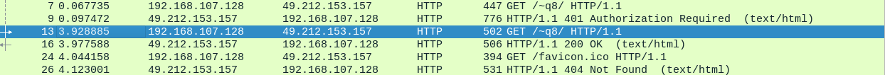
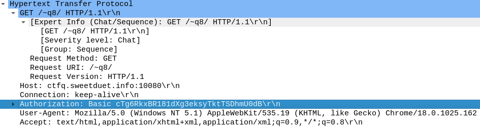

# ksnctf: Basic is secure? 

**Category:** Network  
**Points:** 50pt  
**Description:**  

> http://ksnctf.sweetduet.info/q/8/q8.pcap

**Hint:**

>

## 解き方
`pcap`が配布されるので，脳死でwiresharkを開きhttpでフィルタをかけてみる．(タイトルからしてBasic認証だろうなと思ったので)

`No.9`で認証の要求があることから，`No.13`で認証情報を送信し，コンテンツを要求しているだろうなと目を付ける．httpの`Authorization`に目的のCredentialsがありflagを入手できる．basicは`base64`のエンコードなので，デコードで中身が丸見えだねといった意図があるのかな．デコードは`echo "hogefugapiyo" | base64 -d`で簡単に出来てしまうし...

一連のやり取りの最後に`favicon.ico`ねぇーよ！と言われているのがツボでした．
