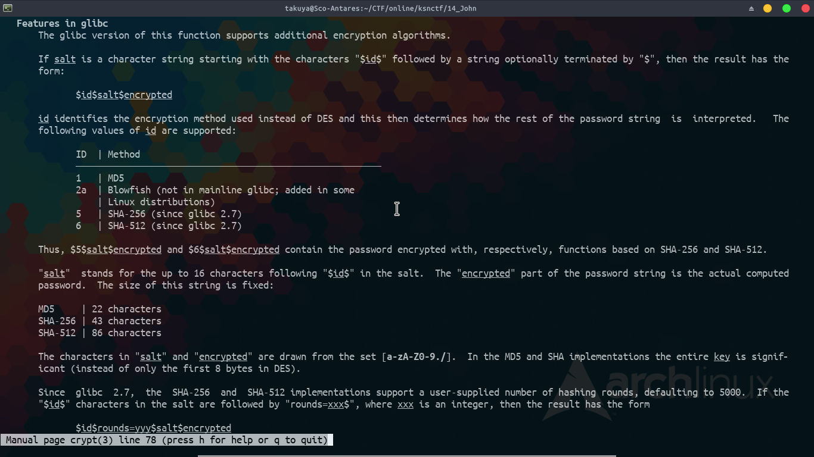

# ksnctf: John

**Category:** Crypto  
**Points:** 70pt  
**Description:**  

> user00:\$6\$Z4xEy/1KTCW.rz\$Yxkc8XkscDusGWKan621H4eaPRjHc1bkXDjyFtcTtgxzlxvuPiE1rnqdQVO1lYgNOzg72FU95RQut93JF6Deo/:15491:0:99999:7:::
> user01:\$6\$ffl1bXDBqKUiD\$PoXP69PaxTTX.cgzYS6Tlj7UBvstr6JruGctoObFXCr4cYXjIbxBSMiQZiVkKvUxXUC23zP8PUyXjq6qEq63u1:15491:0:99999:7:::
> user02:\$6\$ZsJXadT/rv\$T/2gVzYwMBaAsZnHIjnUSmTozIF/ebMvtHIJjikFehvB8pvy28DUIQYbTJLG6QAxhzJAKOROnZq0xV4hUGefM1:15491:0:99999:7:::  
> 省略 

**Hint:**

>

## 解き方
`/etc/shadow`の出力ファイルっぽいし，タイトルから`John the Ripper`を使うのだろうなぁと思った．`$6$`はSHA512でハッシュ化されたことを示している．この辺の詳細はcryptのマニュアルに載っている．



問題文については，user00,01,02...と進み，最後のuser99は指示だった．

> user99:\$6\$SHA512IsStrong\$DictionaryIsHere.http//ksnctf.sweetduet.info/q/14/dicti0nary_8Th64ikELWEsZFrf.txt:15491:0:99999:7:::

SHA512 is strong. Dictionary is here:  
http://ksnctf.sweetduet.info/q/14/dicti0nary_8Th64ikELWEsZFrf.txt  

user00からuser20の情報を`shadow`に保存，Dictionaryをwgetか何かで手元にDLして`John`する．

```
$ wget http://ksnctf.sweetduet.info/q/14/dicti0nary_8Th64ikELWEsZFrf.txt

$ john --wordlist=dicti0nary_8Th64ikELWEsZFrf.txt shadow                                                                           
Warning: detected hash type "sha512crypt", but the string is also recognized as "sha512crypt-opencl"
Use the "--format=sha512crypt-opencl" option to force loading these as that type instead
Warning: detected hash type "sha512crypt", but the string is also recognized as "crypt"
Use the "--format=crypt" option to force loading these as that type instead
Loaded 21 password hashes with 21 different salts (sha512crypt, crypt(3) $6$ [SHA512 64/64 OpenSSL])
Will run 4 OpenMP threads
Press 'q' or Ctrl-C to abort, almost any other key for status
floating         (user13)
ADDITIONAL       (user02)
HELD             (user10)
ultimate         (user08)
opinion          (user15)
zero             (user19)
karaoke          (user17)
QUESTION         (user16)
SPIRITS          (user06)
__________       (user04)
DELIGHT          (user20)
GENDER           (user03)
FREQUENT         (user00)
JENNY            (user09)
SUFFERS          (user11)
strange          (user18)
zecht            (user14)
independent      (user07)
applies          (user05)
LATTER           (user01)
LEAVE            (user12)
21g 0:00:00:32 DONE (2018-12-05 21:56) 0.6523g/s 94.50p/s 947.4c/s 947.4C/s AMBIENT..ADMIRATION
Use the "--show" option to display all of the cracked passwords reliably
Session completed
```

無事にcrack出来たようなので，結果を`--show`で眺めるとflagが隠れていた．`$ john --show shadow | cut -b 8`で抽出した．

```
$ john --show shadow 
user00:FREQUENT:15491:0:99999:7:::
user01:LATTER:15491:0:99999:7:::
user02:ADDITIONAL:15491:0:99999:7:::
user03:GENDER:15491:0:99999:7:::
user04:__________:15491:0:99999:7:::
user05:applies:15491:0:99999:7:::
user06:SPIRITS:15491:0:99999:7:::
user07:independent:15491:0:99999:7:::
user08:ultimate:15491:0:99999:7:::
user09:JENNY:15491:0:99999:7:::
user10:HELD:15491:0:99999:7:::
user11:SUFFERS:15491:0:99999:7:::
user12:LEAVE:15491:0:99999:7:::
user13:floating:15491:0:99999:7:::
user14:zecht:15491:0:99999:7:::
user15:opinion:15491:0:99999:7:::
user16:QUESTION:15491:0:99999:7:::
user17:karaoke:15491:0:99999:7:::
user18:strange:15491:0:99999:7:::
user19:zero:15491:0:99999:7:::
user20:DELIGHT:15491:0:99999:7:::
21 password hashes cracked, 0 left
```